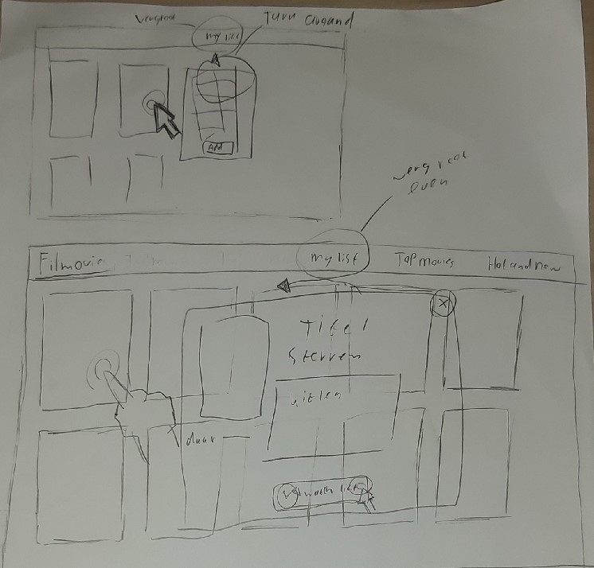
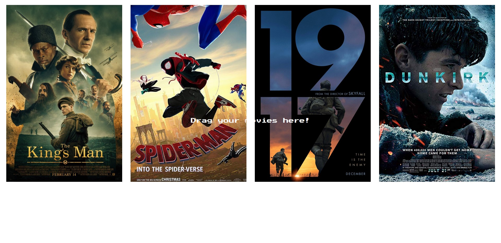
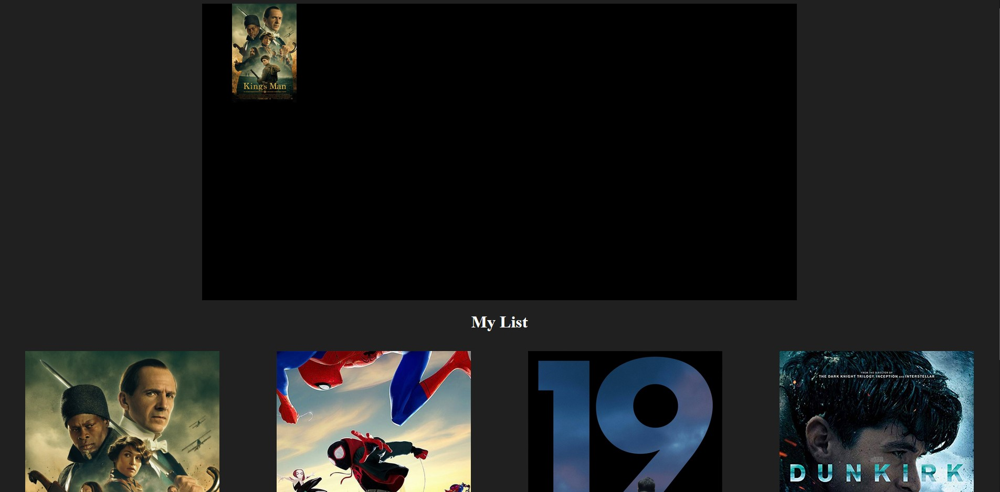
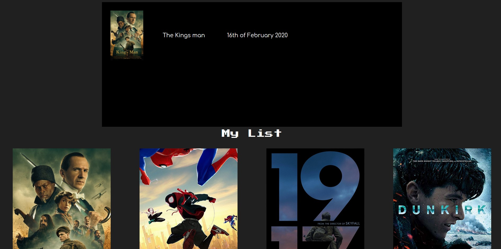
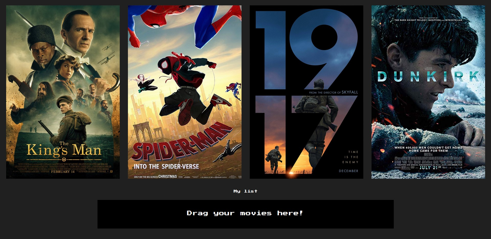
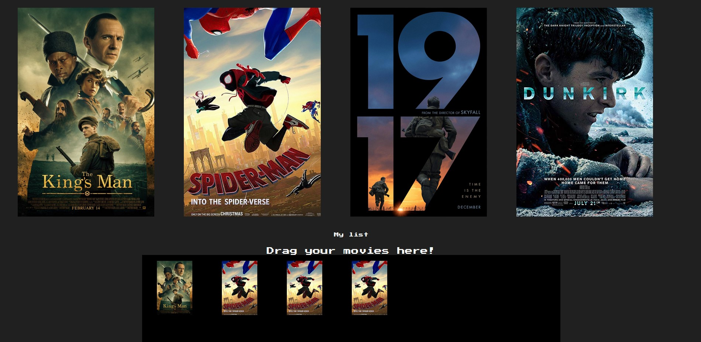
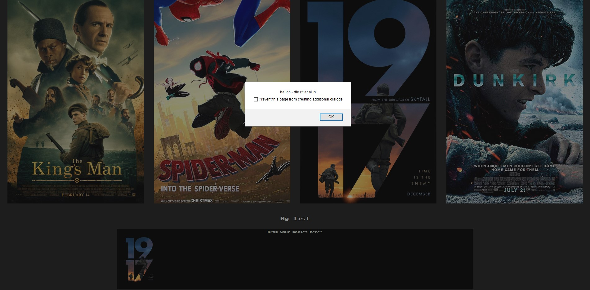
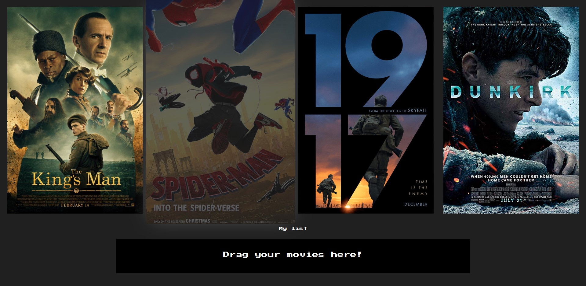

# Frontend voor Designers - opdracht 1: Een Micro-interactie uitwerken en testen

Ik heb gekozen voor de case: In een verzameling films wil ik een aantal leuke films kunnen bewaren om ze later te bekijken.

## stap 1: Schetsen

Ik ben meteen begonnen met schetsen. Ik besloot een website te maken voor desktop dus heb die grote ook aangehouden. Mijn eerste idee was om een lijst optie in de nav te hebben en een aantal films op de pagina heb staan. Als je over een film heen hovert draaid hij om en kan je hem toevoegen.

Mijn tweede idee was bijna het zelfde maar dan met een popup inplaats van een hover.

## stap 2: html

Toen ben ik begonnen met de html. Eerst heb ik de films op de pagina gezet.

Daarna heb ik de kleuren wat aangepast en besloot ik in plaats van een nav een soort drop box voor je films te maken. Dus ik heb boven de films een box toegevoegd met een film placeholder, nog niks werkt hier echt.

Hierna heb ik achter het plaatje de film titel toegevoegd en de release date.

Uiteindelijk heb ik de dropbox verplaatst naar de onderkant.

## stap 3: Javascript

Tijdens de les kwam ik erachter dat er een javascript code is genaamd sortable. Met sortable kan je objecten in een ander stuk html schuiven dus als het waren een interactieve drop box maken, en dat is was dus mijn idee.

Ik wil dus dat je met de muis de films in de dropbox kunt slepen. Ik ben samen met de help docenten (sorry ik ben de naam vergeten!) gaan kijken hoe we dat konden laten werken. Eerst hebben we het zo gemaakt dat je de films in de box kan slepen. Daarna hebben we via CSS ervoor gezorgd dat de image scaled in de drop box.

Hierna wilde ik niet dat de film verdween zodra hij in de box zat. Dus heb ik ervoor gezorgd dat hij word gedupliceerd.

het enige probleem is dat je de film meerdere keren in de box kon doen en ik wilde eigenlijk dat je dat maar 1 keer kan doen.

Eerst heb ik het geprobeerd door het met een array te doen, maar dit werkte niet helemaal. Daarna heb ik nog een tijd met Sanne gezeten om het te proberen te fixen, en hij heeft het toen uiteindelijk werkend gekregen (heel erg bedankt!).

Nu heb ik nog een hover gemaakt voor de films zodat het interactief is als je eroverheen hovert. Ik wilde er nog text op laten verschijnen maar dit is mij niet gelukt.

Ook wilde ik het drop menu in en uit het beeld laten schuiven als je op de mijn lijst knop drukt. Alleen ook dit heb ik niet werkend gekregen helaas. Mijn uiteindelijke site ziet er zo uit.

Ik heb een hoop geleerd van deze opdracht en ook een hoop dingen gedaan die ik zelf niet zomaar zou doen. Ik ben over het algemeen wel te vreden met mijn eindproduct, maar ik had toch nog wel die menu knop werkend willen hebben.
