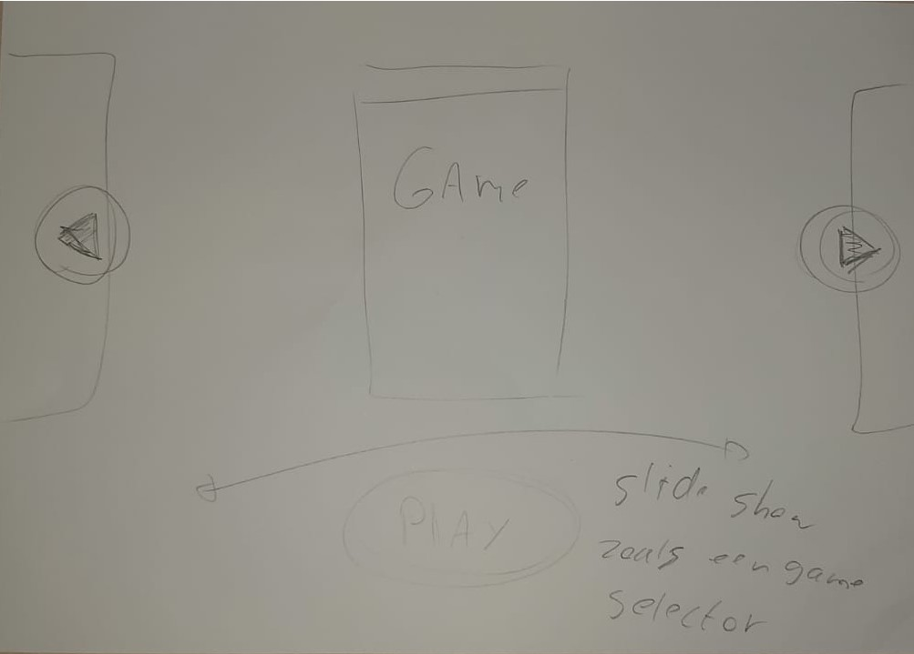
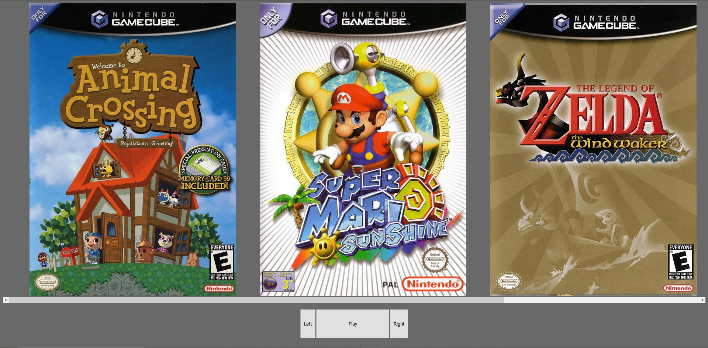
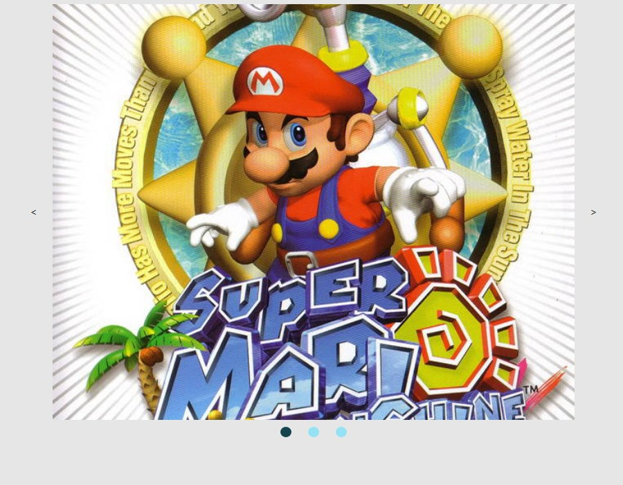
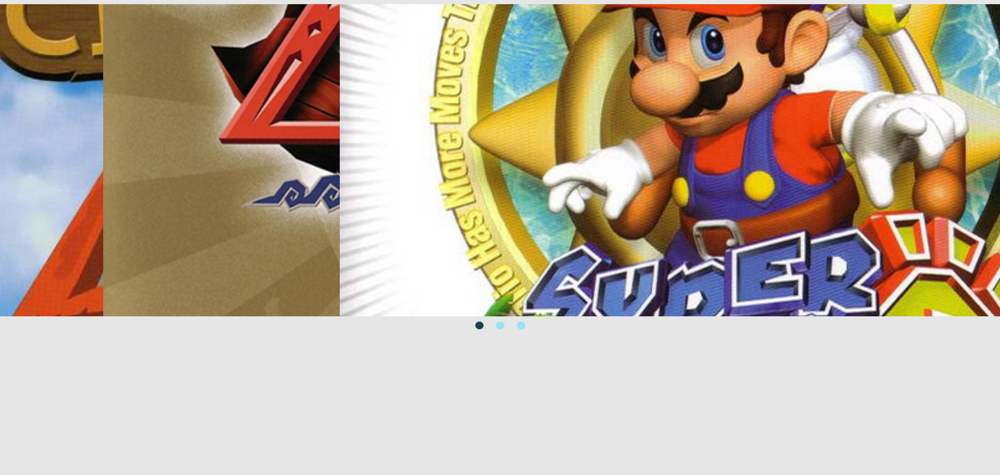
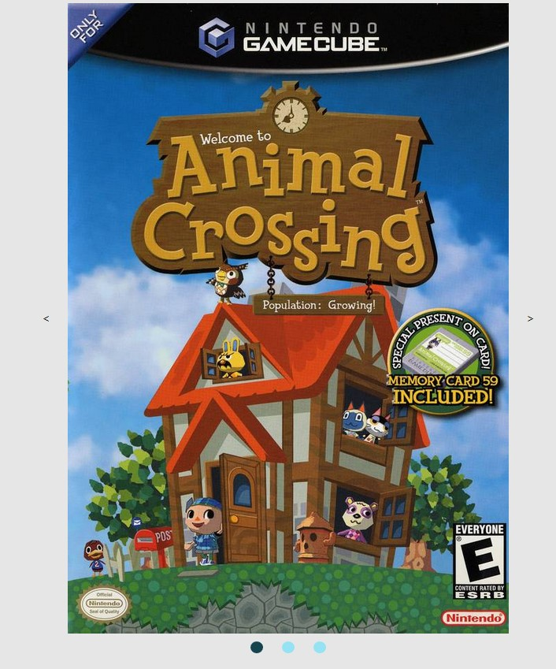

# Frontend voor Designers - opdracht 2: Een interactie uitwerken voor verschillende gebruikers input

Ik heb gekozen voor de case: Carousel/slideshow

## stap 1: Schetsen

Ik ben meteen begonnen met schetsen. Ik wilde een soort game selector maken. Het moet een slideshow van games worden die je met je pijltjes kan besturen. Ook wilde ik een soort fake play button toevoegen alsof het spel word opgestart mischien met een animatie.

## stap 2: html

Ik ben begonnen met alle afbeeldingen naast elkaar te zetten. Daarna heb ik 3 buttons toegevoegd. Deze buttons moeten uiteindelijk de afbeeldingen laten bewegen.

Daarna heb ik de afbeeldingen achter elkaar gezet. Vanaf hier probeerde ik een slideshow te maken met javascript.

Het lukte me niet helemaal zelf, dus ik heb wat youtube tutorials opgezocht voor hulp. (https://www.youtube.com/watch?v=KcdBOoK3Pfw&t=1172s, https://www.youtube.com/watch?v=VYsVOamdB0g) met behulp van deze video's kwam ik alweer een stuk verder.

Nu heb ik het half werkend, ik kan 1 keer naar rechts maar niet meer terug en de afbeeldingen scalen niet helemaal lekker mee.

Ik heb een hoop geleerd van de tutorials, vooral de add classlists en remove classlists heeft een deur voor me geopent. Ook heb ik eindelijk geleerd wat const zijn. Deze opdracht ging wel ver buiten mijn javascript confort zone (die niet echt heel groot is) maar dat voelde uiteindelijk wel goed. Ik vindt het alleen jammer dat ik de pijltjes toetsen niet wekrend heb gekregen. Ik had een stukje code van Guus Groenink bekeken alleen die werkte niet helemaal met mijn javascript. Ik heb wel een idee waarom het niet werkte ik kon het alleen niet zo aanpassen dat het werkte met mijn javascript.

