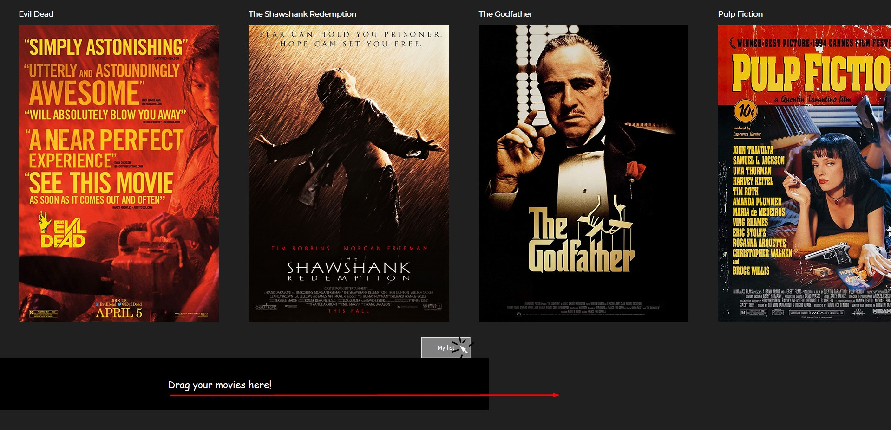
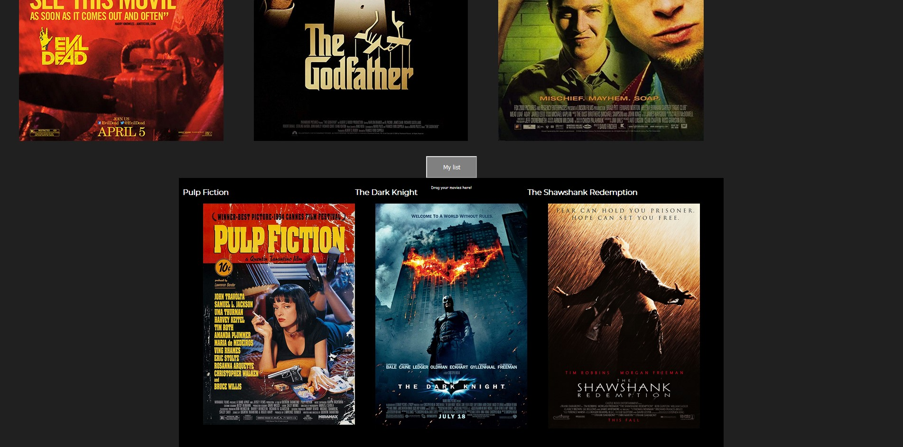
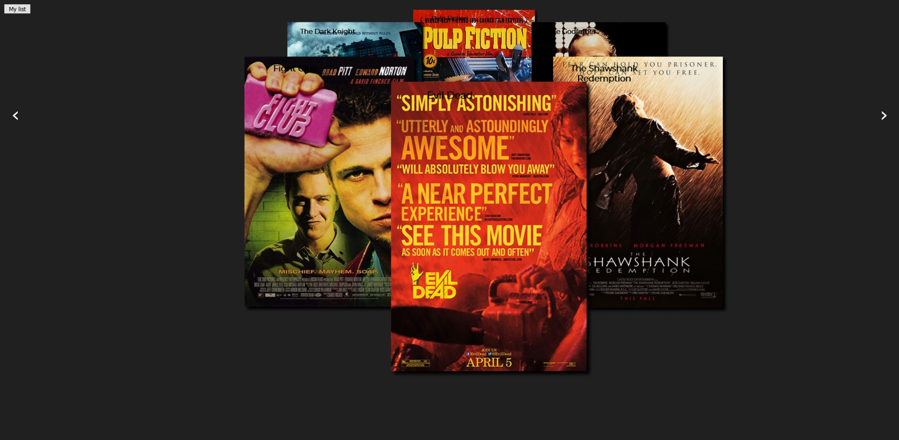
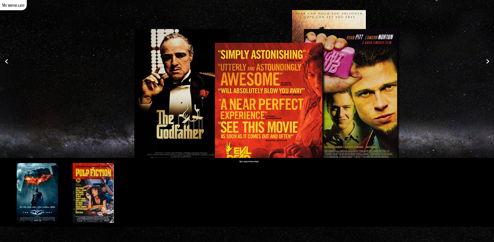

# frontend voor designers - opdracht 3: Een interactie uitwerken met externe data

mijn plan is om een carrousel van films te maken die ik dan daaruit kan slepen in een dropbox, en ik wil de dropbox in en uit het scherm kunnen laten komen.

## stap 1: Schetsen

Mijn idee is om een carousel plugin en de Sortable plugin samen te gebruiken zodat ik door films kan swipen en ze dan kan droppen in een watch later box. Nu wil ik alles wat eerst niet lukte wel laten werken zoals pijltjes toetsen controlls en het in en uitklap menu

## stap 2: html

Ik Heb nu een filmposter en de titel erboven vanuit de Json op de pagina gekregen.

Nu heb ik met een array alle films met de titels eronder op de pagina gekregen. Het ging op zich wel vlot maar ik maakte hier wat foutjes waardoor alles een stuk moeilijker ging dan had gekund maar het werkt nu!

Ik heb nu mijn bestaande code aangepast met behulp van Sanne dat er nu articles van de posters en titles wordt gemaakt. Ook heb ik nu sortable toegevoegd zodat ik ik kan beginnen met de drop box maken.

Nu heb ik de opmaak van de website wat verbeterd zodat alles wat overzichtelijker is en netjes staat.

Ik wil de drop box/film lijst veranderen in een soort drop down, maar dan meer een drop up omdat het omhoog moet schuiven in het beeld zodra je op de button klikt. Ik krijg het niet voor elkaar hoe ik dat kan doen.

Ik heb nu wel de button werkend gekregen in java script maar ik snap niet hoe je de position dan kan veranderen van de drop box. Ik neem aan dat met een function moet maar ik kom er niet helemaal uit waar ik precies moet beginnen.

Ik heb met behulp van de codepen van Sanne het in en uit schuif menu werkend gekregen zoals ik het wilde. Het was wel een hoop trial and error. Ik wilde hem uit het beeld laten schuiven zonder dat mijn viewport groter werd, dit is mij uiteindelijk gelukt door position fixed te gebruiken. Nu heb ik onderaan mijn website een film lijst die in en uit beeld komt schuiven.

Nu ik het sortable gedeelte, en het menu af heb wil ik de carrousel gaan maken. Ik heb het eerst geprobeerd met de code van mijn opdracht 2. Maar ik kwam er niet helemaal uit. Ik moest meerdere ID's aanmaken dan voor "li" die vanuit de jason werden aangemaakt, ik kwam wel zover dat ik 1 ID kon afmaken maar alle "li" kregen dan die ID. Dus na veel klooien ben ik maar weer overnieuw begonnen.

Ik heb heel wat tutorials gekeken op youtube, en meerdere tutorials online opgezocht maar veel van die tutorials gebruikte Jquery, en ik heb geen idee hoe dat werkt. Dus daarna ben ik naar Sanne's codepen gegaan en heb naar zijn soort van 3D carrousel codepen gekeken. Dankzij dit heb ik nu een werkende carousel met sortable samen of eigenlijk bijna werkend

Het ding was hij werkte volledig, ik kon de images door elkaar husselen, ik kon ze in mijn uitklapmenu slepen, en ik kon naar links draaien en met de pijltjes en het pijltje op het scherm. Alleen ik kon dus niet naar rechts draaien. Zodra ik pijltje naar rechts drukte of op het rechter pijltje klikte stackde alle posters ineens op elkaar, en kon ik verder ook niet meer iets besturen. Ik had uiteindelijk een spelfout gemaakt bij de functie van het naar rechts gaan. Nadat ik dit had gefixed werkte hij volledig zoals ik het in eerste instantie had voorgesteld.

Nu heb ik de website nog wat mooier gemaakt met wat hovers en kleuren en vind ik hem best wel goed gelukt.

