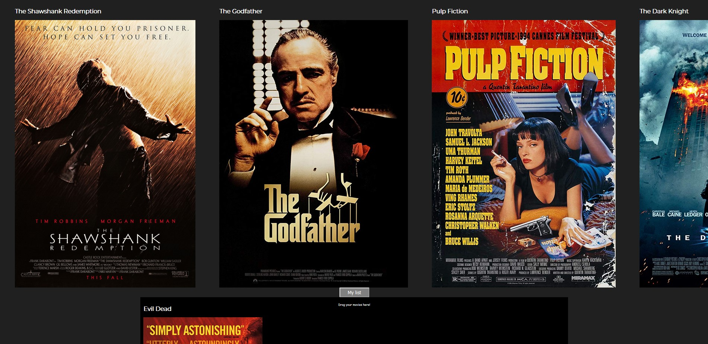

Door verkeerd inplannen van mijn andere opleveringen heb ik niet veel verandering nuu, maar daar ga ik dit weekend mee verder.

# frontend voor designers - opdracht 3: Een interactie uitwerken met externe data

mijn plan is om een carousel van films te maken die ik dan daaruit kan slepen in een dropbox, en ik wil de dropbox in en uit het scherm kunnen laten komen.

## stap 1: Schetsen

Mijn idee is om een carousel plugin en de Sortable plugin samen te gebruiken zodat ik door films kan swipen en ze dan kan droppen in een watch later box. Nu wil ik alles wat eerst niet lukte wel laten werken zoals pijltjes toetsen controlls en het in en uitklap menu

## stap 2: html

Ik Heb nu een film poster en de titel erboven vanuit de Json op de pagina gekregen.

Nu heb ik met een array alle films met de titels eronder op de pagina gekregen. Het ging op zich wel vlot maar ik maakte hier wat foutjes waardoor alles een stuk moeilijker ging dan had gekunt maar het werkt nu!

Ik heb nu mijn bestaande code aangepast met behulp van Sanne dat er nu articles van de posters en titles wordt gemaakt. Ook heb ik nu sortable toegevoegd zodat ik ik kan beginnen met de drop box maken.

Nu heb ik de opmaak van de website wat verbeterd zodat alles wat overzichtelijker is en netjes staat.

Ik wil de drop box/film lijst veranderen in een soort drop down, maar dan meer een drop up omdat het omhoog moet schuiven in het beeld zodra je op de button klikt. Ik krijg het niet voor elkaar hoe ik dat kan doen.

Ik heb nu wel de button werkend gekregen in java script maar ik snap niet hoe je de position dan kan veranderen van de drop box. Ik neem aan dat met een function moet maar ik kom er niet helemaal uit waar ik precies moet beginnen.

Naast dat het menu in en uit het beeld moet schuiven wil ik van de lijst van films eigenlijk een carousel/gallery maken. Ik ben nog opzoek naar een makkelijke plug-in daarvoor maar ik kan zover alleen nog maar J-query plug ins vinden die ik niet begrijp, en anders moet ik het gewoon zelf coderen mischien even naar mijn opdracht 2 kijken daarvoor.

